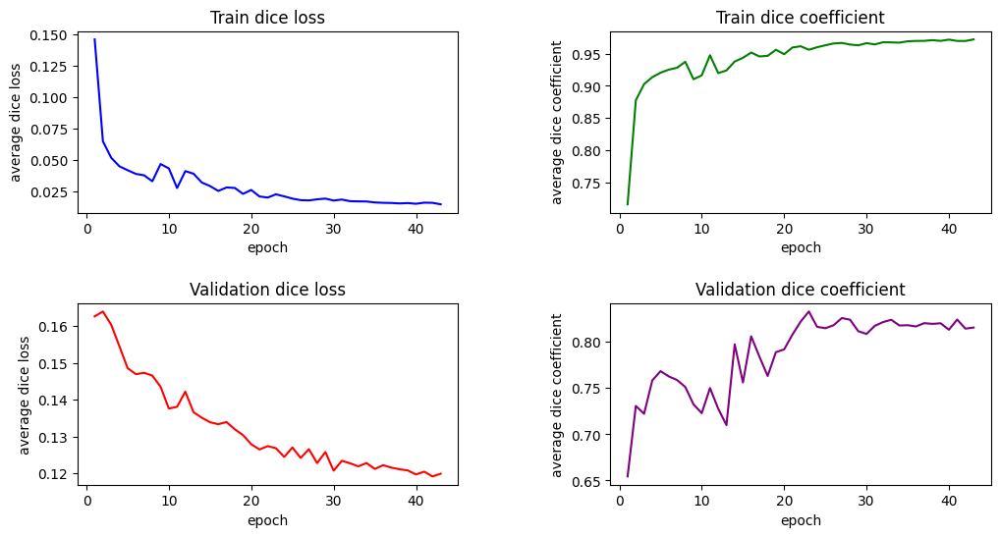
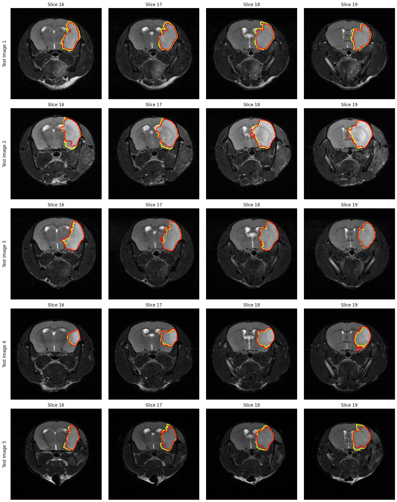

# Transfer Learning for Brain Lesion Segmentation in 3D Pre-Clinical Magnetic Resonance Images

This repository contains the implementation of transfer learning approaches for brain lesion segmentation using 3D pre-clinical magnetic resonance images (MRIs). The project explores various segmentation models, including RatLesNetV2, 3D UNet, Dynamic UNet, and UNetR, with an emphasis on transfer learning techniques.

## Project Overview

This study investigates the application of domain transfer learning in pre-clinical image analysis, focusing on brain lesion segmentation from 3D MRIs of mice. The project leverages the RatLesNetV2 model, pre-trained on rat MRI data, and fine-tunes it for mice brain MRIs to segment lesion areas. Additionally, several other state-of-the-art models, including 3D UNet, Dynamic UNet, and UNetR, are trained and evaluated on the same dataset. Various training sample sizes, with and without data augmentation, are used to assess the performance of these models.

### Key Features:
- Implementation of **transfer learning** using the RatLesNetV2 model.
- Fine-tuning approaches: **partial** and **full fine-tuning** of the model.
- Comparison of segmentation performance across different models: **3D UNet**, **Dynamic UNet**, **UNetR**, and **RatLesNetV2**.
- Evaluation metrics: **Dice Coefficient (DC)** and **95% Hausdorff distance (HD95)**.
- Use of **MONAI framework** for training and data processing.
- Exploration of different training sample sizes with **data augmentation**.

## Models Implemented
- **RatLesNetV2**: A 3D Convolutional Neural Network specifically designed for rodent brain lesion segmentation.
- **3D UNet**: A popular segmentation model that excels in 3D volumetric medical data processing.
- **Dynamic UNet**: A model with dynamic computational resolution levels and deep supervision for enhanced flexibility.
- **UNetR**: Combines the strengths of UNet and Transformer’s self-attention mechanism to improve contextual understanding in segmentation tasks.

## Dataset

The dataset used for this project consists of **T2-weighted MRI scans of mice** with middle cerebral artery occlusion (MCAo) and sham operations. Images were acquired on a **7T MR scanner** using a 2D RARE sequence and processed into **NIfTI format** for segmentation tasks.

- **Training, Validation, Testing Split**: 70% training, 10% validation, and 20% testing.
- **Transfer Learning Data**: Lesion-balanced training sets were created with different sample sizes ranging from 8 to 40 images for transfer learning experiments.

## Repository Structure

- `prepare.py`: Code for data preparation, including loading and preprocessing MRI images and masks for model training.
- `train.py`: Code for training the model, calculating Dice loss, and evaluating Dice Coefficient during training.
- `metrics.py`: Code for custom loss function `MyDiceLoss`, and implementation of additional metrics such as Hausdorff distance (HD95).
- `evaluate_hd95.py`: Code for evaluating HD95 and Dice metrics on the test set.
- `visualize_output.py`: Code to visualize the model's predicted masks alongside ground truth masks on selected MRI slices.
- `transfer_learning_ratlesnet.py`: Code for fine-tuning the RatLesNetV2 model using transfer learning.
- `create_dataset_for_transfer_learning.py`: Code for selecting a subset of training samples for transfer learning based on lesion sizes.

## Images




## How to Use

### Prerequisites

Install the required dependencies:

```bash
pip install -r requirements.txt
